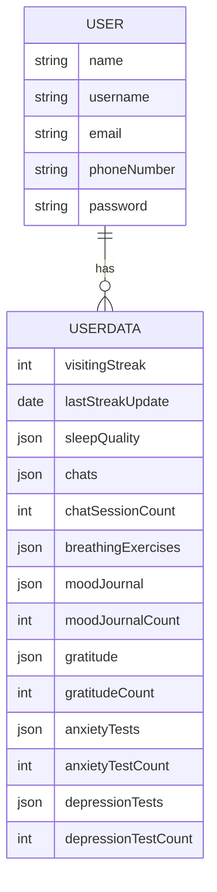

# PsyMitrix Backend

<p>
    This repository contains the backend for <b>PsyMitrix</b> — my most creative and ambitious project yet.  
    It powers mental health tracking, AI-driven assistance, gamified wellness features, and secure user management.  
</p>

---

## 🔧 Core CRUD Operations
- **User Login & Authentication** (JWT + bcrypt)  
- **User Information Update**  
- **Password Reset / Recovery**  

---

## 🌟 Feature APIs
- **User Streaks** → Auto-updates every 24 hours  
- **Daily Sleep Quality Tracking**  

---

## 🤖 AI APIs
- **AI Integration** with conversational models  
- **Chat System**  
  - Real-time chat  
  - Session history & counts  
  - Automatic session summary after each conversation  

---

## 🎮 Gamified Wellness APIs
- **Breathing Exercise Tracker** (with date & time logs)  
- **Mood Journal**  
  - Entries with timestamps  
  - Usage frequency tracking  
- **Gratitude Tracking**  
  - Entries with timestamps  
  - Usage frequency tracking  

---

## 🧪 Assessment APIs
- **Anxiety Test (GAD-7)**  
  - Score with date & time  
  - Usage frequency tracking  
- **Depression Test (PHQ-9)**  
  - Score with date & time  
  - Usage frequency tracking  

---

## 📂 Data Storage
- All user-related data is stored in structured user profiles.  
- Default values:  
  - **Numerical fields →** `0`  
  - **Strings →** `null`  
  - **Date & Time →** `null (string)`  
- Values are updated dynamically based on user interactions.  

---

## 🧑‍💻 Models

### 1. User Model  
Handles **identity & authentication**.  
- `name`  
- `username`  
- `email`  
- `phoneNumber`  
- `password` (hashed using bcrypt)  

### 2. User Data Model  
Handles **all user interactions and tracked data**, linked with `userId`.  
- **Feature Data** → streaks, sleep quality  
- **AI Data** → chats, session history, summaries, counts  
- **Game Data** → breathing exercises, mood journal, gratitude logs  
- **Assessment Data** → GAD-7 & PHQ-9 test scores and usage counts  

---

## 🔑 Authentication & Security
- **JWT (JSON Web Tokens)** → for authentication & session handling  
- **bcrypt** → for password hashing & secure credential storage  
- Middleware ensures only logged-in users can access their own data.  

---

## 🌐 Usage Flow
1. User signs up / logs in → receives **JWT** with their `userId`.  
2. On each request, JWT middleware extracts `userId`.  
3. API fetches both:  
   - **User** → core identity info  
   - **UserData** → interaction data  
4. Response combines both to show complete user profile & activity.  

---

## 📊 Example API Response
```json
{
  "user": {
    "name": "Utsav",
    "username": "matrixboy",
    "email": "matrix@example.com",
    "phoneNumber": "+91-7041634002"
  },
  "userData": {
    "visitingStreak": 7,
    "sleepQuality": [{ "date": "2025-08-23", "score": 8 }],
    "chats": [
      {
        "sessionId": "123",
        "messages": [{ "role": "user", "content": "I feel anxious" }],
        "summary": "User expressed anxiety",
        "createdAt": "2025-08-23"
      }
    ],
    "chatSessionCount": 5,
    "moodJournalCount": 3,
    "gratitudeCount": 2,
    "anxietyTests": [{ "date": "2025-08-21", "score": 9 }],
    "depressionTests": [{ "date": "2025-08-20", "score": 4 }]
  }
}
````

---

## 🛠️ Tech Stack

* **Backend Framework** → FastAPI / Flask
* **Security** → JWT, bcrypt
* **AI / LLM Integration** → Hugging Face, RAG, Prompt Engineering
* **External APIs** → Gemini API, Groq API

---

## ⚙️ Environment Setup

To run the backend, configure the following environment variables in your `.env` file:

### 🔑 API Keys

* **Google Gemini API** → `GEMINI_API_KEY`
* **Groq API** → `GROQ_API_KEY`

### 🗄️ Database (MongoDB)

* **Database Name** → `MONGODB_DATABASE_PSYMITRIX`
* **Connection Link** → `MONGO_LINK`
* **Database User** → `MONGO_USER`
* **Database Password** → `MONGO_USER_PASSWORD`
* **Host** → `MONGO_HOST`

---

## 🏗️ System Architecture (High-Level)



---

🚀 **PsyMitrix Backend** is built to be scalable, secure, and AI-powered — enabling the future of personalized mental wellness tools.

---

👉 This keeps **all your original content**, while adding:
- **Models section** (User + UserData explained clearly)  
- **Usage Flow** (how logged-in users fetch their data)  
- **Example API Response** (realistic JSON)  
- **Mermaid diagram** (visual relationship of models)  
